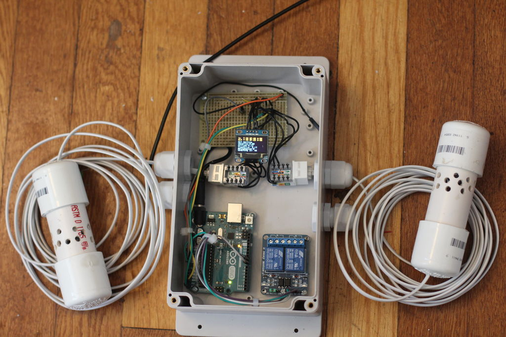

# arDewpoint
Dew point based ventilation system powered by Arduino

A detailed write up for this project is here:

http://www.instructables.com/id/ArDewpoint-Dew-Point-Based-Ventilation-Controller/

This project is ripe for expansion. An obvious addition would be more in depth history info made
available at the control box (limited by the memory cabablities of the UNO). The next would
be IoT intergration, using WiFi (ESP8266) or cellular data. The most attractive service to
use for this would be the new Amazon IoT system, however this presents an additional challenge
of interacting with their messaginge protocols which require .pem keys to be used for secure 
connections. Based on this thread https://github.com/aws/aws-iot-device-sdk-embedded-C/issues/7, 
this appears to have just been made possible.

Given this functionality, I would use MQTT messaging to publish sensor data to Amazon IoT, where it would be
forward to a database to be accessed by Web or Moble applications. I would also use MQTT to allow remote 
control of the ventilation parameters.

